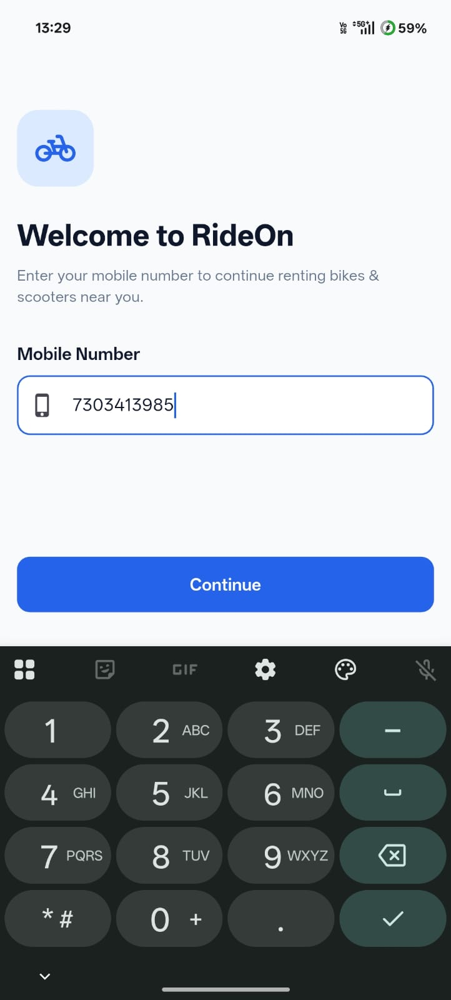
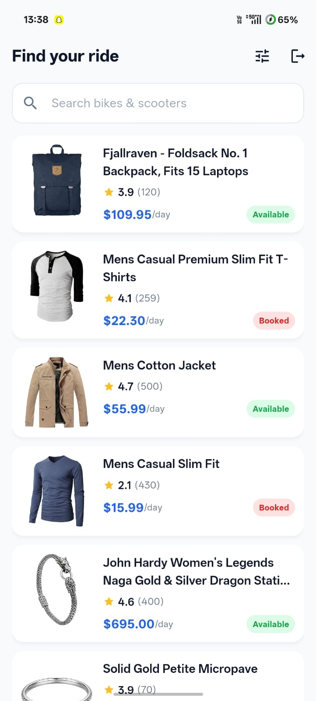
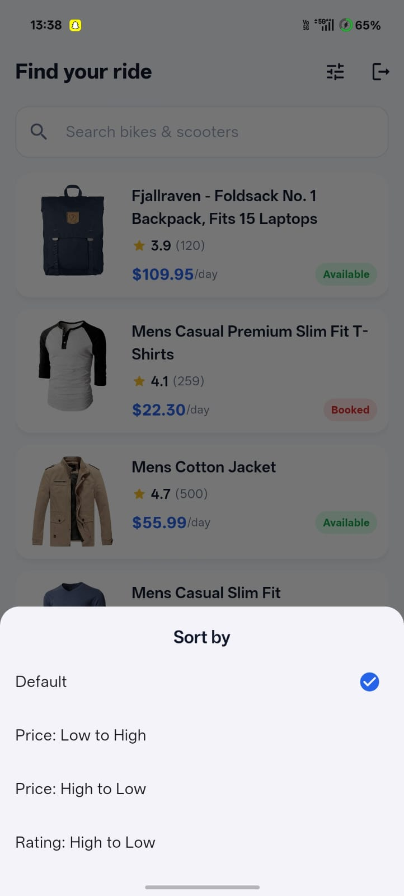
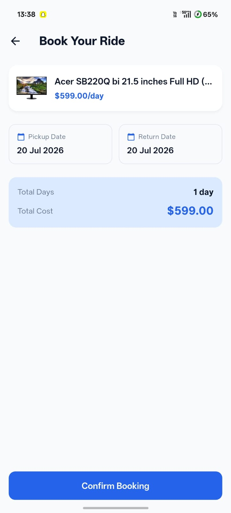
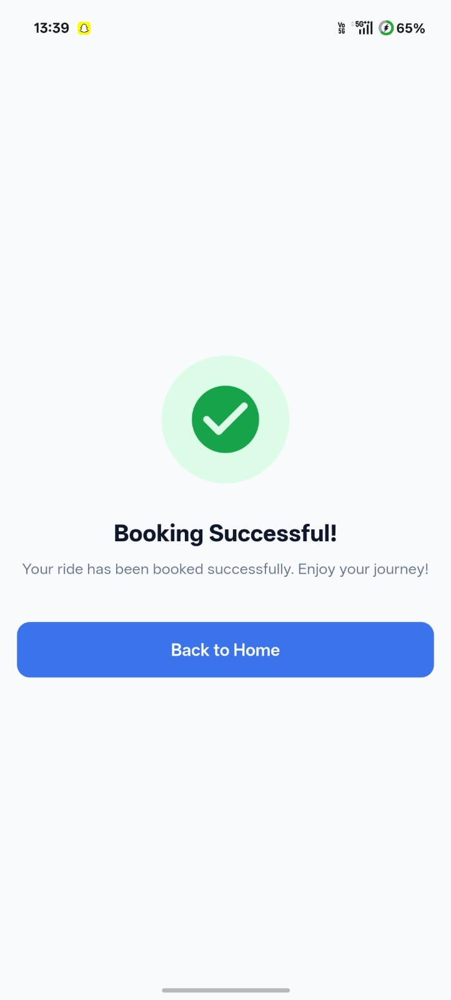
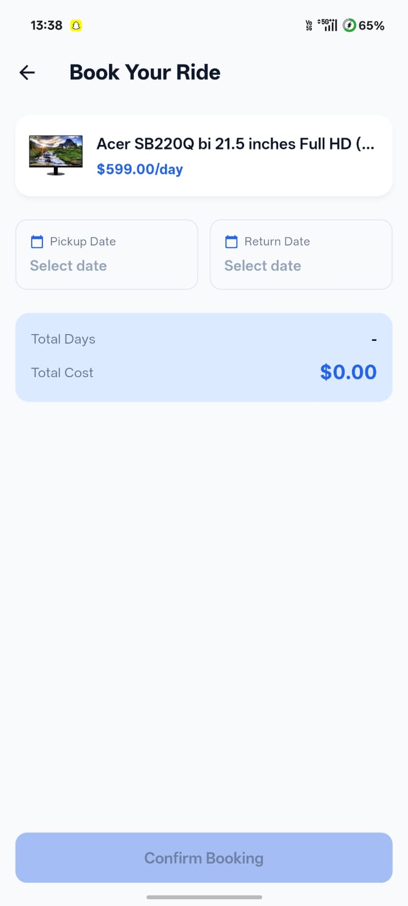

# RideOn — Bike & Scooter Rental Marketplace

A production-quality Flutter application for browsing, searching, and booking
bikes & scooters. Built with clean architecture, Provider state management,
and Material 3.

---

## 1. Project Overview

RideOn simulates a real rental marketplace: users log in with a mobile
number + OTP, browse a catalog of vehicles (sourced from
[fakestoreapi.com](https://fakestoreapi.com/products) and remapped into
rental-domain terms), search and sort the catalog, view details, and complete
a date-range booking with a computed total cost.

The codebase is organized to mirror how a real product team would structure
a mid-size Flutter app: a `core/` layer for cross-cutting concerns, a
`services/` layer that isolates I/O (network + local storage), `providers/`
that hold all business logic and app state, and `screens/`/`widgets/` that
are "dumb" — they only render state and forward user intent to providers.

## 2. Features

- **Authentication** — mobile number entry, OTP verification (dummy code
  `123456`), persisted session via `SharedPreferences`, and logout.
- **Splash flow** — checks login state on launch and routes to Home or
  Login accordingly.
- **Catalog (Home)** — live search-as-you-type, sort by price (asc/desc)
  and rating, pull-to-refresh, skeleton loading state, error state with
  retry, and empty state.
- **Bike Details** — Hero image transition, rating, description, price,
  availability, and a Book Now CTA (disabled when unavailable).
- **Booking** — pickup/return date pickers, validation (return ≥ pickup),
  live total-days and total-cost calculation.
- **Booking Success** — animated confirmation screen with a way back Home.
- **Robust error handling** — no internet, request timeout, server errors,
  invalid OTP, and empty results are all handled with user-facing messages.

## 3. Folder Structure

```text
lib/
├── main.dart                  # App entry point, DI wiring, MaterialApp
├── core/
│   ├── constants/              # App-wide strings & config constants
│   ├── theme/                  # Material 3 theme + color palette
│   ├── utils/                  # Validators, date helpers, extensions
│   └── widgets/                # Low-level shared widgets (skeleton loader)
├── models/
│   └── product_model.dart      # Bike/scooter domain model
├── services/
│   ├── api_service.dart        # Dio-based networking
│   ├── auth_service.dart       # Login/OTP/logout business rules
│   └── storage_service.dart    # SharedPreferences wrapper
├── providers/
│   ├── auth_provider.dart
│   ├── product_provider.dart
│   └── booking_provider.dart
├── screens/
│   ├── splash/  login/  otp/  home/  details/  booking/  success/
├── widgets/                    # Feature-level reusable widgets
│   ├── bike_card.dart  custom_button.dart  custom_search_bar.dart
│   ├── rating_widget.dart  loading_widget.dart  empty_widget.dart
│   └── error_widget.dart
└── routes/
    └── app_routes.dart         # Named routes + route generator
```

## 4. Packages Used

| Package               | Purpose                                   |
|------------------------|-------------------------------------------|
| `provider`             | State management                          |
| `dio`                  | HTTP client for the products API          |
| `shared_preferences`   | Persisting login session locally          |
| `cached_network_image` | Efficient, cached image loading           |
| `intl`                 | Date formatting                           |
| `flutter_lints` (dev)  | Static analysis / linting                 |

No other dependencies are used — animations, shimmer effects, and the
"connection error" case are all implemented with Flutter's own APIs
(`AnimationController`, `Hero`, `DioExceptionType.connectionError`) to keep
the dependency graph minimal.

## 5. How to Run

This repository ships the Dart/Flutter source (`lib/`) and `pubspec.yaml`.
Platform folders (`android/`, `ios/`, etc.) are intentionally not included —
generate them once locally, then drop this `lib/` folder in:

```bash
# 1. Scaffold platform folders (only needed once)
flutter create .

# 2. Install dependencies
flutter pub get

# 3. Run static analysis (optional but recommended)
flutter analyze

# 4. Run the app
flutter run
```
   
   
   
   
   
   
   
   
   
> If `flutter create .` overwrites `pubspec.yaml`, re-copy the one from this
> repo before running `flutter pub get`.

## 6. Screenshots


| Login | OTP | Home | Details | Booking | Success |
|-------|-----|------|---------|---------|---------|
|  |  |  |  |  |  |

## 7. APK Build Command

```bash
flutter build apk --release
```

The generated APK will be located at:
`build/app/outputs/flutter-apk/app-release.apk`

## 8. Git Commands

```bash
git init
git add .
git commit -m "Initial project setup"
git branch -M main
git remote add origin <your-repo-url>
git push -u origin main
```

### Suggested commit history

1. `chore: initial project setup and folder structure`
2. `feat: add core theme, colors, constants and utils`
3. `feat: add product model and API service with Dio`
4. `feat: implement authentication (login + OTP) flow`
5. `feat: add AuthProvider and storage service integration`
6. `feat: implement splash screen with auto-navigation`
7. `feat: build home screen with product listing`
8. `feat: add search and sort functionality`
9. `feat: implement bike details screen with Hero animation`
10. `feat: implement booking flow with date validation`
11. `feat: add booking success screen with animation`
12. `fix: handle API errors, timeouts and empty states`
13. `style: polish UI, spacing, and card shadows`
14. `docs: add README with setup and architecture notes`

## 9. Architecture, State & API Flow (Interview Notes)

### Layered architecture

```
Screens (UI)  →  Providers (state + business logic)  →  Services (I/O)
     ↑                     ↓
     └────── Consumer/Selector rebuilds on notifyListeners() ──────┘
```

- **Screens/Widgets** never call `Dio` or `SharedPreferences` directly. They
  read state via `Consumer<T>` / `context.watch<T>()` and call methods on a
  provider via `context.read<T>()`.
- **Providers** (`ChangeNotifier`) hold UI state (loading/success/error,
  search query, sort option, selected dates, etc.) and orchestrate calls to
  services. They call `notifyListeners()` after every state change.
- **Services** are the only layer that touches the network or local
  storage: `ApiService` (Dio), `StorageService` (SharedPreferences),
  `AuthService` (business rules on top of storage).

### Dependency injection

`main.dart` wires everything with `MultiProvider`:
- `StorageService` and `ApiService` are provided as plain `Provider`s.
- `AuthService` is built from `StorageService` via `ProxyProvider`.
- `AuthProvider` and `ProductProvider` are `ChangeNotifierProxyProvider`s
  built from their respective services, so screens simply do
  `context.watch<AuthProvider>()` without knowing how it was constructed.
- `BookingProvider` has no service dependency (booking is simulated), so
  it's a plain `ChangeNotifierProvider`.

### App/state flow

1. **Splash** calls `AuthProvider.checkLoginStatus()`, which asks
   `AuthService.isLoggedIn()` (backed by `StorageService`), and routes to
   Home or Login.
2. **Login → OTP**: `AuthProvider.sendOtp()` simulates sending a code;
   `AuthProvider.verifyOtp()` compares the entered code against the dummy
   OTP and, on success, persists the session and flips `isLoggedIn`.
3. **Home**: on first build, `ProductProvider.fetchProducts()` calls
   `ApiService.fetchProducts()`, which hits `GET /products` on
   fakestoreapi.com via Dio, maps each JSON item to a `ProductModel`
   (remapping `title → bikeName`, `price → dailyRentalPrice`, deriving
   `isAvailable` from the item's index), and stores the state as
   `loading → loaded` or `loading → error`. `filteredProducts` is a
   computed getter that applies the current search query and sort option
   without re-fetching.
4. **Details → Booking**: the tapped `ProductModel` is passed as a route
   argument (no re-fetching). `BookingProvider` calculates `totalDays` and
   `totalCost` reactively as the user picks pickup/return dates, and
   validates that the return date isn't before the pickup date.
5. **Success**: `BookingProvider.confirmBooking()` simulates a booking
   request and flips `bookingConfirmed`; the screen then clears the
   navigation stack back to Home.

### Error handling strategy

`ApiService` translates every `DioException` into a typed `ApiException`
(`noInternet`, `timeout`, `server`, `unknown`) with a user-friendly message.
`ProductProvider` surfaces that message through `errorMessage`, and the
`AppErrorWidget` shows it with a Retry button that re-triggers
`fetchProducts()`.

## 10. Future Improvements

- Replace the simulated booking/auth backends with real endpoints.
- Add a "My Bookings" screen backed by local persistence or a backend.
- Add unit tests for providers/services and widget tests for key screens.
- Add pagination/infinite scroll if the catalog grows large.
- Add dark theme support via a second `ColorScheme`.
- Add map-based vehicle discovery (nearby bikes/scooters).